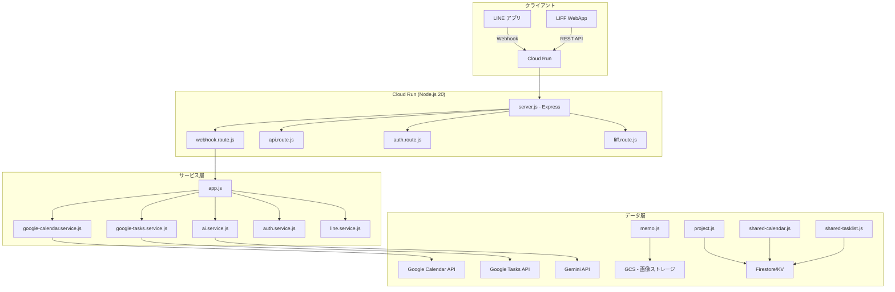
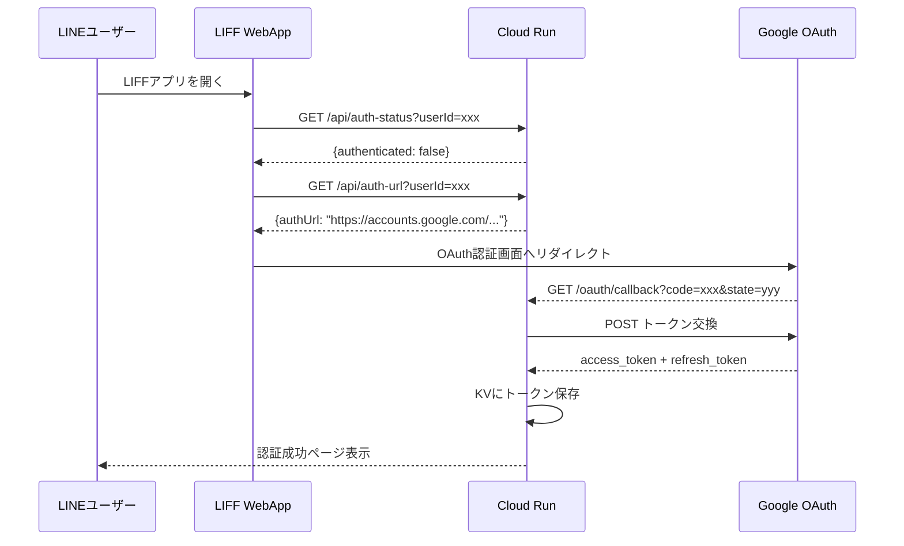

# LINE Calendar & Tasks Bot — プロジェクト仕様書

> **バージョン**: 2.0.0  
> **最終更新**: 2026-02-23  
> **リポジトリ**: [kingqueen0114-bit/line-calendar-bot](https://github.com/kingqueen0114-bit/line-calendar-bot)

---

## 1. プロジェクト概要

LINE Messaging API を利用したカレンダー&タスク管理ボット。ユーザーは **LINE チャット** での自然言語入力、または **LIFF (LINE Front-end Framework) WebApp** のGUIを通じて、Google Calendar / Google Tasks と連携した予定・タスクの管理が可能。

### ターゲットユーザー
- 日常的にLINEを利用する日本語ユーザー
- Google Calendarで予定管理をしているが、LINEから手軽に操作したい個人/チーム

### 主要機能サマリー
| カテゴリ | 機能 |
|---|---|
| 📅 カレンダー | 予定の作成・閲覧・検索・更新・削除 |
| ✅ タスク | タスクの作成・完了・更新・削除・一覧 |
| 📝 メモ | テキスト&画像メモの作成・閲覧・削除 |
| 👥 共有 | プロジェクト単位の共有カレンダー/共有タスクリスト |
| 🤖 AI | Gemini APIによる自然言語解析 |
| ⏰ 通知 | 予定リマインダー・タスク期限通知 |
| 🔐 認証 | Google OAuth 2.0 マルチユーザー認証 |

---

## 2. システムアーキテクチャ



### 技術スタック
| 項目 | 技術 |
|---|---|
| ランタイム | Node.js 20+ (ES Modules) |
| フレームワーク | Express 4.x |
| ホスティング | Google Cloud Run (asia-northeast1) |
| コンテナ | Docker (node:20-slim) |
| データストア | Firestore (KV互換アダプタ経由) |
| 画像ストレージ | Google Cloud Storage |
| AI | Google Gemini API |
| スケジューラ | Google Cloud Scheduler (15分間隔) |

---

## 3. 認証・認可

### 3.1 OAuth 2.0 フロー



### 3.2 OAuthスコープ
| スコープ | 用途 |
|---|---|
| `calendar.events` | カレンダーイベントのCRUD |
| `calendar.calendarlist.readonly` | ユーザーのカレンダーリスト読み取り |
| `tasks` | タスクのCRUD |

### 3.3 セキュリティ
| 機構 | 詳細 |
|---|---|
| CSRF防止 | ランダム64文字 state パラメータ (TTL: 10分) |
| トークン自動リフレッシュ | 有効期限の5分前に自動更新 |
| リフレッシュトークンローテーション | Googleからの新トークンをKVに反映 |
| 失効時の再認証誘導 | 自動revoke → LINEで再認証URL送信 |
| 署名検証 | LINE Webhook の HMAC-SHA256 検証 |

---

## 4. 機能仕様

### 4.1 カレンダー管理 (Google Calendar API)

| 機能 | LINE チャット | LIFF API | エンドポイント |
|---|---|---|---|
| 予定作成 | ✅ 自然言語 | ✅ フォーム | `POST /api/events` |
| 予定一覧 | ✅ 「予定確認」 | ✅ カレンダーUI | `GET /api/events` |
| 予定検索 | ✅ キーワード指定 | — | — (app.js内部) |
| 予定更新 | ✅ 自然言語 | ✅ フォーム | `POST /api/events/update` |
| 予定削除 | ✅ 「〇〇キャンセル」 | ✅ ボタン | `DELETE /api/events` |
| カレンダーリスト | — | ✅ 設定画面 | `GET /api/calendars` |

#### 対応イベント形式
- **終日予定**: `start.date` / `end.date`
- **時間指定予定**: `start.dateTime` / `end.dateTime` (タイムゾーン: `Asia/Tokyo`)
- **付加情報**: 場所 (`location`), URL, メモ (`description`)

#### マルチカレンダー対応
- ユーザーは設定画面でGoogleカレンダーの表示ON/OFFをトグル
- 複数カレンダーのイベントは並列取得→時系列マージ
- KVキー: `settings:{userId}.enabledCalendars`

### 4.2 タスク管理 (Google Tasks API)

| 機能 | LINE チャット | LIFF API | エンドポイント |
|---|---|---|---|
| タスク作成 | ✅ 「タスク 〇〇」 | ✅ フォーム | `POST /api/tasks` |
| 未完了一覧 | ✅ 「タスク一覧」 | ✅ リスト表示 | `GET /api/tasks` |
| 完了済み一覧 | — | ✅ トグル表示 | `GET /api/tasks/completed` |
| タスク完了 | ✅ 「N完了」 | ✅ チェック | `POST /api/tasks/complete` |
| 完了取消し | — | ✅ ボタン | `POST /api/tasks/uncomplete` |
| タスク更新 | — | ✅ フォーム | `POST /api/tasks/update` |
| タスク削除 | — | ✅ ボタン | `DELETE /api/tasks` |
| リスト取得 | — | ✅ タブ表示 | `GET /api/tasklists` |

#### タスクのデータ構造
```json
{
  "title": "牛乳を買う",
  "due": "2026-02-24T00:00:00Z",
  "listName": "買い物リスト",
  "starred": false
}
```

### 4.3 メモ機能

| 機能 | エンドポイント | 詳細 |
|---|---|---|
| メモ一覧取得 | `GET /api/memos` | テキスト+画像メモを時系列で取得 |
| メモ作成 | `POST /api/memos` | テキストまたはBase64画像を送信 |
| メモ削除 | `DELETE /api/memos` | GCS画像も同時に削除 |

- 画像は GCS バケット `line-calendar-bot-memos` に保存
- ファイルパス: `{userId}/{timestamp}-{random}.jpg`

### 4.4 共有カレンダー

プロジェクト（グループ）単位で複数ユーザー間でカレンダーを共有。

| 機能 | エンドポイント |
|---|---|
| プロジェクト作成 | `POST /api/projects` |
| プロジェクト一覧 | `GET /api/projects` |
| プロジェクト更新 | `POST /api/projects/update` |
| プロジェクト削除 | `DELETE /api/projects` |
| 招待コードで参加 | `POST /api/projects/join` |
| プロジェクト退出 | `POST /api/projects/leave` |
| メンバー取得 | `GET /api/projects/members` |
| 共有予定一覧 | `GET /api/shared-events` |
| 共有予定作成 | `POST /api/shared-events` |
| 共有予定削除 | `DELETE /api/shared-events` |

#### 招待コード
- 8桁のランダム英数字（大文字）
- KVキー: `invite:{code}` → `{projectId}`
- オーナーのみ再生成可能

### 4.5 共有タスクリスト

| 機能 | エンドポイント |
|---|---|
| リスト作成 | `POST /api/shared-tasklists` |
| リスト一覧 | `GET /api/shared-tasklists` |
| リスト更新 | `POST /api/shared-tasklists/update` |
| リスト削除 | `DELETE /api/shared-tasklists` |
| 招待コードで参加 | `POST /api/shared-tasklists/join` |
| リスト退出 | `POST /api/shared-tasklists/leave` |
| 共有タスク作成 | `POST /api/shared-tasks` |
| 共有タスク一覧 | `GET /api/shared-tasks` |
| 共有タスク完了 | `POST /api/shared-tasks/complete` |
| 共有タスク削除 | `DELETE /api/shared-tasks` |

### 4.6 AI 自然言語解析 (Gemini API)

LINEチャットのテキストメッセージを Gemini API で解析し、構造化データに変換。

#### 入力例 → 出力

| ユーザー入力 | 解析結果 |
|---|---|
| 「明日14時 ミーティング」 | `{action:"create", type:"event", title:"ミーティング", date:"2026-02-24", startTime:"14:00"}` |
| 「タスク 牛乳を買う 期限明日」 | `{action:"create", type:"task", title:"牛乳を買う", date:"2026-02-24"}` |
| 「予定確認」 | `{action:"list", type:"event"}` |
| 「タスク一覧」 | `{action:"list", type:"task"}` |
| 「ミーティングをキャンセル」 | `{action:"cancel", type:"event", title:"ミーティング"}` |
| 「1完了」 | `{action:"complete", targetNumber:1}` |

#### 処理フロー
1. ユーザーメッセージ受信
2. `parseEventText()` で Gemini API に送信（リトライ付き）
3. JSON 応答をパース
4. `action` に応じて `handleCreateAction` / `handleListAction` / `handleCancelAction` / `handleCompleteAction` を実行

### 4.7 通知システム

| 通知タイプ | トリガー | 条件 | 重複防止 |
|---|---|---|---|
| 予定リマインダー | Cloud Scheduler (15分毎) | 開始10〜35分前 | `notified:{userId}:{eventId}` (TTL 24h) |
| タスク期限通知 | Cloud Scheduler (15分毎) | 朝8〜10時 (JST) | `task_notified:{userId}:{date}` (TTL 24h) |

#### 通知設定
- `POST /api/settings/notifications` でリマインダーON/OFF切替
- KVキー: `settings:{userId}.reminderEnabled`

---

## 5. LIFF WebApp 仕様

### 5.1 画面構成

| タブ | 内容 |
|---|---|
| 📅 カレンダー | 月/週/日ビュー + イベント一覧 |
| ✅ タスク | タスクリスト別タブ + 完了済みトグル |
| 📝 メモ | リスト/グリッド/コンパクト表示切替 |
| ⚙️ 設定 | アカウント、カレンダー管理、テーマ、通知 |

### 5.2 設定画面の機能
| 項目 | 説明 |
|---|---|
| アカウント | ユーザー名、Google連携状態 |
| 個人カレンダー | 作成・編集・削除 |
| 共有カレンダー | 作成・参加(招待コード)・退出 |
| 共有タスクリスト | 作成・参加・退出 |
| テーマカラー | 20色から選択 |
| 表示設定 | 初期表示(月/週/日)、週の開始日、曜日表記 |
| Googleカレンダー同期 | 各カレンダーの表示ON/OFFトグル |
| 通知設定 | リマインダーON/OFF |

### 5.3 UIコンポーネント
- FAB (Floating Action Button): 予定/タスク/メモの新規作成
- モーダル: 予定作成、タスク作成、メモ作成、プロジェクト管理
- トースト通知: 操作結果の表示
- Auth Banner: 未認証時の認証誘導バナー

---

## 6. データストア設計

### 6.1 KVキー一覧

| キーパターン | 値 | TTL | 用途 |
|---|---|---|---|
| `user_tokens:{userId}` | `{accessToken, refreshToken, expiresAt, scope}` | — | OAuth トークン |
| `oauth_state:{state}` | `{userId, timestamp}` | 600s | CSRF state |
| `authenticated_users` | `[userId, ...]` | — | 認証済みユーザーリスト |
| `notification_users` | `[userId, ...]` | — | 通知登録ユーザーリスト |
| `settings:{userId}` | `{reminderEnabled, enabledCalendars, ...}` | — | ユーザー設定 |
| `memo:{userId}:{memoId}` | `{id, text, imageUrl, createdAt}` | — | メモデータ |
| `memo_list:{userId}` | `[memoId, ...]` | — | メモIDリスト |
| `project:{projectId}` | `{id, name, color, members, owner, inviteCode}` | — | プロジェクト |
| `user_projects:{userId}` | `[projectId, ...]` | — | ユーザーのプロジェクトリスト |
| `invite:{code}` | `{projectId}` | — | 招待コード→プロジェクト |
| `shared_event:{projId}:{evtId}` | `{id, title, date, ...}` | — | 共有イベント |
| `shared_events_list:{projId}` | `[eventId, ...]` | — | 共有イベントIDリスト |
| `shared_tasklist:{listId}` | `{id, name, color, members, ...}` | — | 共有タスクリスト |
| `shared_task:{listId}:{taskId}` | `{id, title, completed, ...}` | — | 共有タスク |
| `notified:{userId}:{eventId}` | `"true"` | 86400s | 通知済みフラグ |
| `task_notified:{userId}:{date}` | `"true"` | 86400s | タスク通知済み |
| `pending_complete_{userId}` | `[task, ...]` | 600s | 完了待ちタスク候補 |
| `pending_cancel_{userId}` | `[event, ...]` | 600s | キャンセル待ち候補 |
| `last_bot_response_{userId}` | `"message text"` | 300s | AI文脈保持 |

---

## 7. API エンドポイント一覧

### 認証
| メソッド | パス | 説明 |
|---|---|---|
| GET | `/oauth/callback` | OAuth コールバック |
| GET | `/api/auth-status` | 認証状態確認 |
| GET | `/api/auth-url` | 認証URL取得 |

### カレンダー
| メソッド | パス | 説明 |
|---|---|---|
| GET | `/api/events` | 予定一覧 (90日) |
| POST | `/api/events` | 予定作成 |
| POST | `/api/events/update` | 予定更新 |
| DELETE | `/api/events` | 予定削除 |
| GET | `/api/calendars` | Googleカレンダーリスト |

### タスク
| メソッド | パス | 説明 |
|---|---|---|
| GET | `/api/tasks` | 未完了タスク一覧 |
| POST | `/api/tasks` | タスク作成 |
| POST | `/api/tasks/update` | タスク更新 |
| POST | `/api/tasks/complete` | タスク完了 |
| POST | `/api/tasks/uncomplete` | 完了取消し |
| GET | `/api/tasks/completed` | 完了済み一覧 |
| DELETE | `/api/tasks` | タスク削除 |
| GET | `/api/tasklists` | タスクリスト一覧 |

### メモ
| メソッド | パス | 説明 |
|---|---|---|
| GET | `/api/memos` | メモ一覧 |
| POST | `/api/memos` | メモ作成 |
| DELETE | `/api/memos` | メモ削除 |

### 共有カレンダー
| メソッド | パス | 説明 |
|---|---|---|
| GET | `/api/projects` | プロジェクト一覧 |
| POST | `/api/projects` | プロジェクト作成 |
| POST | `/api/projects/update` | プロジェクト更新 |
| DELETE | `/api/projects` | プロジェクト削除 |
| POST | `/api/projects/join` | 招待コードで参加 |
| POST | `/api/projects/leave` | プロジェクト退出 |
| GET | `/api/projects/members` | メンバー一覧 |
| GET | `/api/shared-events` | 共有予定一覧 |
| POST | `/api/shared-events` | 共有予定作成 |
| DELETE | `/api/shared-events` | 共有予定削除 |

### 共有タスク
| メソッド | パス | 説明 |
|---|---|---|
| GET | `/api/shared-tasklists` | 共有タスクリスト一覧 |
| POST | `/api/shared-tasklists` | リスト作成 |
| POST | `/api/shared-tasklists/update` | リスト更新 |
| DELETE | `/api/shared-tasklists` | リスト削除 |
| POST | `/api/shared-tasklists/join` | 招待コードで参加 |
| POST | `/api/shared-tasklists/leave` | リスト退出 |
| GET | `/api/shared-tasks` | 共有タスク取得 |
| POST | `/api/shared-tasks` | 共有タスク作成 |
| POST | `/api/shared-tasks/complete` | 共有タスク完了 |
| DELETE | `/api/shared-tasks` | 共有タスク削除 |

### 設定
| メソッド | パス | 説明 |
|---|---|---|
| GET | `/api/settings/notifications` | 通知設定取得 |
| POST | `/api/settings/notifications` | 通知設定更新 |
| GET | `/api/settings/calendars` | カレンダー同期設定取得 |
| POST | `/api/settings/calendars` | カレンダー同期設定保存 |

### その他
| メソッド | パス | 説明 |
|---|---|---|
| POST | `/webhook` | LINE Webhook |
| GET | `/liff` | LIFF HTMLレスポンス |
| POST | `/scheduled` | Cloud Scheduler 通知トリガー |
| GET | `/health` | ヘルスチェック |

---

## 8. ディレクトリ構成

```
src/
├── server.js                  # Express サーバー + ルート登録
├── app.js                     # LINE Webhook ハンドラー + AI処理
├── routes/
│   ├── api.route.js           # LIFF 用 REST API (全エンドポイント)
│   ├── auth.route.js          # OAuth コールバック
│   ├── liff.route.js          # LIFF HTML レスポンス
│   └── webhook.route.js       # LINE Webhook ルーティング
├── services/
│   ├── auth.service.js        # OAuth 2.0 トークン管理
│   ├── google-calendar.service.js  # Calendar API 操作
│   ├── google-tasks.service.js     # Tasks API 操作
│   ├── google-shared-tasks.service.js  # 共有タスク (Firestore)
│   ├── ai.service.js          # Gemini API 自然言語解析
│   └── line.service.js        # LINE Messaging API
├── database/
│   ├── memo.js                # メモ + GCS画像
│   ├── project.js             # プロジェクト/グループ
│   ├── shared-calendar.js     # 共有カレンダー
│   └── storage.js             # KVストレージアダプタ
└── utils/
    ├── env-adapter.js         # 環境変数 + KVアダプタ
    ├── google-api.js          # fetchWithRetry (リトライユーティリティ)
    └── liff.js                # LIFF HTML ジェネレータ (4500行)
```

---

## 9. 環境変数

| 変数名 | 説明 | 必須 |
|---|---|---|
| `LINE_CHANNEL_ACCESS_TOKEN` | LINE Bot アクセストークン | ✅ |
| `LINE_CHANNEL_SECRET` | LINE Bot 署名検証シークレット | ✅ |
| `GOOGLE_CLIENT_ID` | Google OAuth クライアントID | ✅ |
| `GOOGLE_CLIENT_SECRET` | Google OAuth シークレット | ✅ |
| `OAUTH_REDIRECT_URI` | OAuthコールバックURL | ✅ |
| `GEMINI_API_KEY` | Gemini AI APIキー | ✅ |
| `LIFF_ID` | LINE LIFF ID | ✅ |
| `GOOGLE_CLOUD_PROJECT` | GCPプロジェクトID | ✅ |
| `PORT` | サーバーポート (デフォルト: 3000) | — |

---

## 10. デプロイ

### Cloud Run
```bash
gcloud builds submit --tag gcr.io/PROJECT_ID/line-calendar-bot-v2
gcloud run deploy line-calendar-bot-v2 \
  --image gcr.io/PROJECT_ID/line-calendar-bot-v2 \
  --region asia-northeast1 \
  --allow-unauthenticated
```

### Cloud Scheduler (通知用)
```bash
gcloud scheduler jobs create http calendar-bot-notifications \
  --schedule="*/15 * * * *" \
  --uri="https://SERVICE_URL/scheduled" \
  --http-method=POST \
  --time-zone="Asia/Tokyo"
```

---

## 11. エラーハンドリング

| エラー種別 | 対応 |
|---|---|
| Google API 429 (Rate Limit) | 指数バックオフリトライ (1s→2s→4s, 最大3回) |
| Google API 5xx | 同上 |
| OAuth 401/403 | 自動トークンリフレッシュ → 失敗時は再認証誘導 |
| API 404 | 「リソースが見つかりません」を返却 |
| LINE署名検証失敗 | 401 Unauthorized |

---

## 12. 依存パッケージ

| パッケージ | バージョン | 用途 |
|---|---|---|
| `express` | ^4.18.2 | HTTPサーバー |
| `@google-cloud/firestore` | ^7.3.0 | Firestoreクライアント |
| `@google-cloud/storage` | ^7.7.0 | GCSクライアント (画像保存) |
| `dotenv` | ^16.3.1 | 環境変数読み込み |
| `multer` | ^1.4.5-lts.1 | ファイルアップロード |
| `canvas` | ^3.2.1 | サーバーサイド画像処理 |
